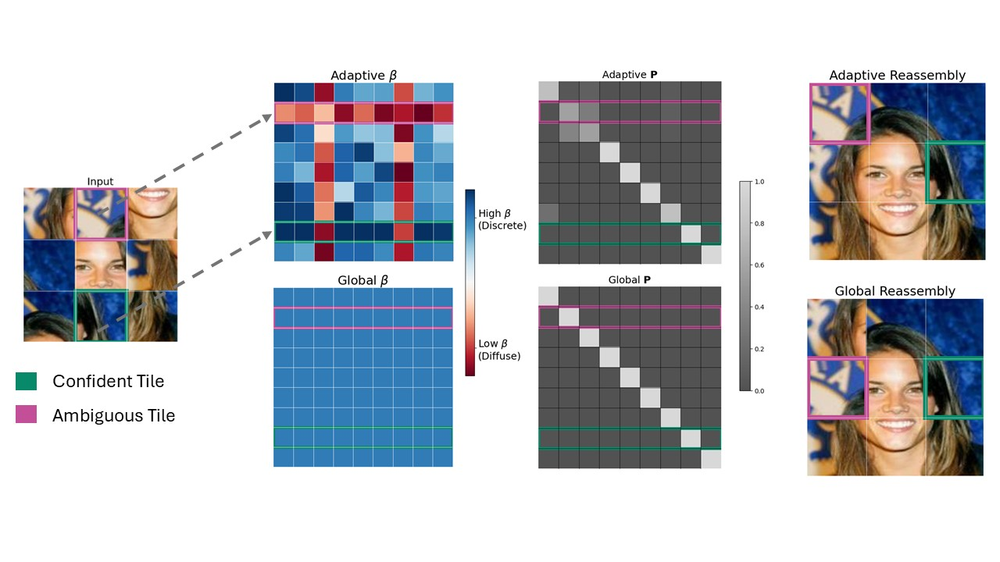

# Learning Permutation from Structure Without Supervision

Accepted to ICML 2026.

## Abstract

Many learning problems require uncovering a hidden ordering that reveals structure in unordered data, such as monotonicity in sorting or spatial continuity in jigsaw reconstruction. In these settings, permutations can be learned as latent operators by optimizing objectives defined directly on the reordered output, often without access to ground-truth orderings. Differentiable relaxations such as Gumbel-Sinkhorn make this approach practical by approximating permutation matrices with doubly stochastic matrices. However, learning from structure without supervision induces a non-uniform uncertainty: some assignments become confident early, while others remain ambiguous. Existing methods control this process using a single global temperature, forcing all assignments to sharpen or diffuse simultaneously and leading to instability at scale. We introduce an entropy-adaptive formulation of Gumbel-Sinkhorn that locally modulates temperature based on assignment uncertainty. This allows confident assignments to discretize early while preserving exploration where uncertainty remains. Across sorting and jigsaw reconstruction tasks and in routing-style settings, adaptive entropy control improves training stability and final permutation quality relative to fixed-temperature baselines, particularly as problem size and assignment ambiguity increase.

## Method Overview



## BibTeX

```bibtex
@inproceedings{eisenberg2026learning,
  title     = {Learning Permutation from Structure Without Supervision},
  author    = {Ran Eisenberg and Ofir Lindenbaum},
  booktitle = {Proceedings of the 43rd International Conference on Machine Learning},
  year      = {2026},
  note      = {Accepted to ICML 2026}
}
```

## Repository Contents

This folder contains the files needed to run the number-sorting benchmarks.

## How to run

From the repo root:

```bash
cd number_sorting
```

Then run the commands below.

### Seed 0

```bash
python benchmark_methods.py --seeds 0 --n_values 5,10,50,100 --out_dir log/tau_adapt_seed0_n_5_to_100
python benchmark_methods.py --seeds 0 --n_values 200,300 --out_dir log/tau_adapt_seed0_n_200_to_300
```

### Seed 1

```bash
python benchmark_methods.py --seeds 1 --n_values 5,10,50,100 --out_dir log/tau_adapt_seed1_n_5_to_100
python benchmark_methods.py --seeds 1 --n_values 200,300 --out_dir log/tau_adapt_seed1_n_200_to_300
```

### Seed 2

```bash
python benchmark_methods.py --seeds 2 --n_values 5,10,50,100 --out_dir log/tau_adapt_seed2_n_5_to_100
python benchmark_methods.py --seeds 2 --n_values 200,300 --out_dir log/tau_adapt_seed2_n_200_to_300
```

## Output

Each run creates a timestamped subfolder under the `--out_dir` you specify, containing:
- `benchmark.log`
- `benchmark_kendall_tau.csv`
- `benchmark_kendall_tau.png`

## Notes

- You'll need Python deps available: `torch`, `numpy`, `scipy`, `matplotlib` (and CUDA if you want GPU runs).
